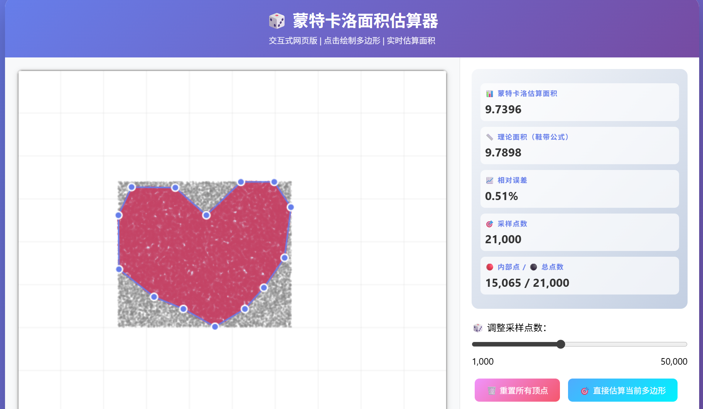

# 🎲 蒙特卡洛面积估算器

一个交互式网页工具，通过蒙特卡洛方法估算任意封闭多边形的面积。

## ✨ 功能

- 左键点击添加顶点，右键闭合多边形
- 随机撒点估算面积，实时可视化
- 与理论面积（鞋带公式）对比，显示误差
- 可调节采样点数

## 🎮 使用方法

1. 左键在画布上点击，添加多边形顶点
2. 添加至少3个顶点后，**右键点击**闭合图形
3. 系统自动进行蒙特卡洛估算，显示结果
4. 可拖动滑块调整采样点数

## 🛠️ 技术栈

- HTML5 Canvas
- 原生 JavaScript
- 无外部依赖

## 📸 截图

## 📄 许可证

MIT
